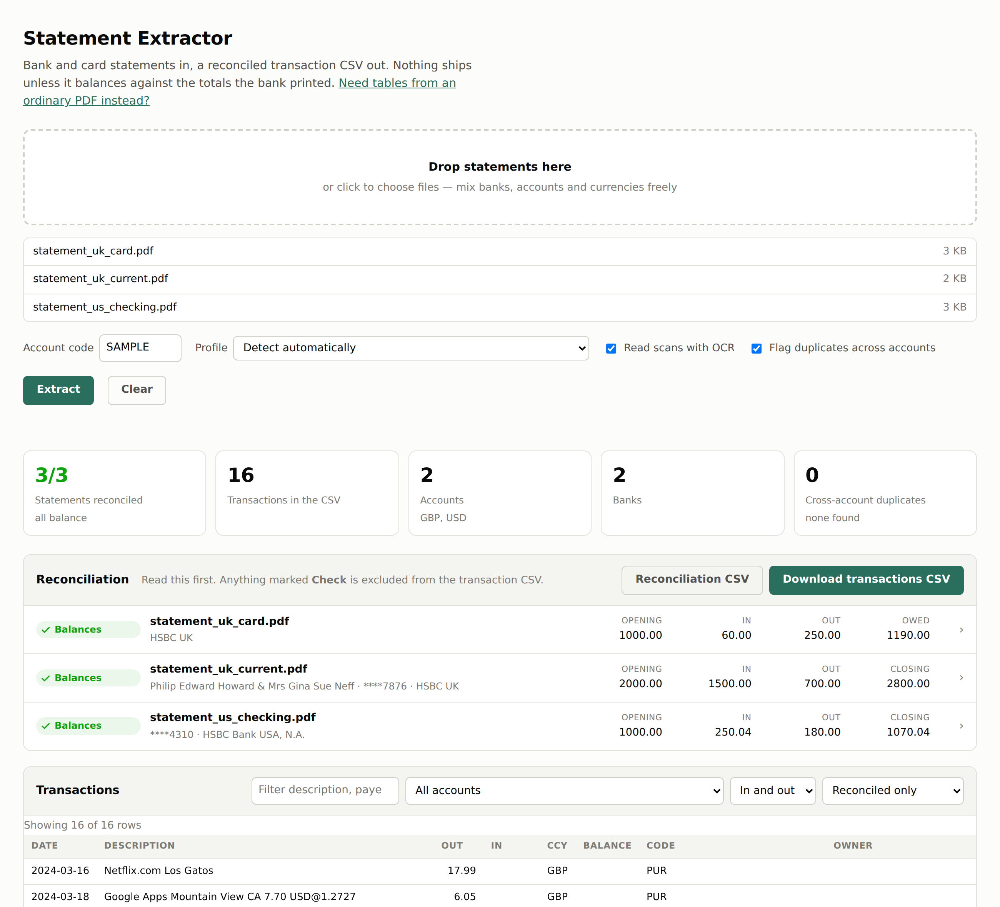

# Statement & Table Extractor

A local web app and CLI for getting transactions out of PDFs.

```bash
python -m venv .venv && source .venv/bin/activate
pip install -e ".[dev]"

# macOS
brew install poppler tesseract
# Debian/Ubuntu
sudo apt-get install poppler-utils tesseract-ocr
# Windows
choco install poppler tesseract

python desktop.py
```

That opens the app in a window. It picks a free port, binds it to `127.0.0.1`,
and prints the address.

## Nothing leaves your machine

Bank statements are not something to hand to a web service, and this one does
not.

* The server binds to the loopback address, so it is not reachable from your
  network — not from another machine, not from your router.
* There is no HTTP client anywhere in the app, and the page makes no
  third-party requests. A test asserts both.
* Uploads go to a temporary directory because poppler and tesseract need real
  files on disk, and it is deleted as soon as the batch has been read. Results
  are held in memory and go when you close the app.
* The repository contains no real statements. The samples that ship with it are
  generated from the test fixtures.

## A standalone app, with no Python to install

```bash
pip install pyinstaller
pyinstaller desktop.spec
```

That produces `dist/statement-extractor` — a single file you can move anywhere
and run by double-clicking. Verified: the built binary runs outside the project
directory with no virtualenv and extracts correctly.

**Build it on the machine you will run it on.** A frozen binary is not portable
between operating systems, so a Mac build has to be made on a Mac.

It still needs poppler installed, and tesseract if any of your statements are
scans. Bundling them is not worth the fragility, and the app checks for both at
startup and prints the exact command to install what is missing.

| | |
|---|---|
| **[Statement extractor](statements/README.md)** — `/` | Bank and card statements. Every figure is validated against the totals the bank printed, and nothing reaches the CSV unless it balances. This is the one to use for statements. |
| **PDF table extractor** — `/tables` | Tables from any text-based PDF, where no reconciliation is possible. Useful for the general case; it does none of the checking. |

Both run entirely on your machine. Statements are read into memory, and the
temporary copies the PDF tools need are deleted as soon as the batch is read.



## The statement extractor

Drop in a folder's worth of statements — mixed banks, accounts, currencies and
cardholders — and it works out which profile reads each one, extracts the
transactions, checks the dates, cross-checks for the same payment appearing in
two accounts, and reconciles every statement against its own printed totals.

Read the reconciliation panel first. Anything marked **Check** is excluded from
the transaction CSV, because a number that does not balance is worse than no
number at all.

The same pipeline is available as a CLI, which is what to use for a scheduled
job:

```bash
statements extract ./inbox --ocr -a CUR1 -o ./out
```

Full documentation: **[statements/README.md](statements/README.md)**.

---

# PDF Table Extractor

Batch-read text-based PDFs, pull the tables out of them, and get a single CSV —
even when different documents spell their column headers differently.

Drop a folder's worth of invoices from four different suppliers in, and
`Amount (USD)`, `Line Total` and `Net Amount` all land in one `amount` column.

## Quick start

```bash
python -m venv .venv && source .venv/bin/activate
pip install -e ".[dev]"

python scripts/make_samples.py        # optional: writes sample PDFs to samples/
uvicorn app.main:app --reload
```

Served at <http://127.0.0.1:8000/tables>. Drop PDFs on the page, click
**Extract**, then **Download CSV**.

## What it does

1. **Extracts** tables with `pdfplumber`, trying ruled-line detection first and
   falling back to whitespace alignment for borderless tables. Tables that run
   over a page break are stitched back together.
2. **Maps** each table's headers onto a *profile* — your stable set of output
   columns — using fuzzy matching, so `Qty`, `Units` and `No. of Units` all
   resolve to `quantity`.
3. **Normalises** values: `$1,234.56` and `1.234,56` both become `1234.56`,
   `(89.50)` becomes `-89.5`, and `01/03/2024` becomes `2024-03-01`.
4. **Writes** one CSV, every row tagged with the file, page and table it came
   from so you can trace anything back to its source.

Tables that match no profile are still included, under their own headers, so
nothing is silently dropped. Untick *Include tables no profile matched* to
suppress them.

## Profiles

Profiles live in `profiles/*.yaml` — one file per document type. Two ship as
starting points: `invoice` and `statement`. To handle your own documents, copy
one and edit it:

```yaml
name: purchase_order
description: Line items from purchase orders.

# Optional: words that should appear in the PDF for this profile to be
# preferred. Useful when several profiles could plausibly fit.
match_text: [purchase order, supplier]

# Headers must be at least this similar to a name or alias to match.
# Raise it if you get wrong matches; lower it if real columns come out blank.
min_confidence: 0.72

columns:
  - name: part_number
    aliases: [part no, sku, item code]
    required: true          # no match here disqualifies the whole profile
  - name: quantity
    aliases: [qty, units]
    type: number            # text (default) | number | date
  - name: delivery_date
    aliases: [due, eta, required by]
    type: date
```

The app picks the best-fitting profile per table automatically; pick one from
the dropdown to force it.

**Tuning against real documents:** open the *Per-file report* after extracting.
It shows each table's profile, its fit score, and exactly which source header
fed each output column (`amount ← "Line Total"`). When a column comes out
`(not found)`, add that document's wording to the column's `aliases`.

## Command line

The web UI is the main interface; the CLI is there for scripting and cron.

```bash
python cli.py samples/ -o out.csv              # a directory, or individual files
python cli.py a.pdf b.pdf -p invoice           # force a profile
python cli.py samples/ --only-matched          # drop unrecognised tables
python cli.py --list-profiles
```

## Scanned PDFs

This tool reads the text layer inside a PDF; it does no OCR. A scanned document
extracts as zero tables and says so in the report. Run such files through OCR
first (`ocrmypdf in.pdf out.pdf`), then feed the output back in.

## Layout

```
statements/       the statement extractor's engine — see statements/README.md
app/main.py       the web server: statements at /, tables at /tables
app/statements_api.py   web API over the statement engine
app/static/       both UIs (no build step)
app/extract.py    PDF -> raw tables (pdfplumber)
app/mapping.py    profiles, fuzzy header matching, value normalisation
app/pipeline.py   batch orchestration -> CSV
app/main.py       FastAPI routes
app/static/       the web UI (no build step)
profiles/         your column definitions
tests/            pytest suite; PDFs are generated, not checked in
```

## Tests

```bash
pytest
```

The suite builds its own PDFs with `reportlab`, so it needs no fixture files
and covers extraction, header matching, value normalisation and the HTTP API.
